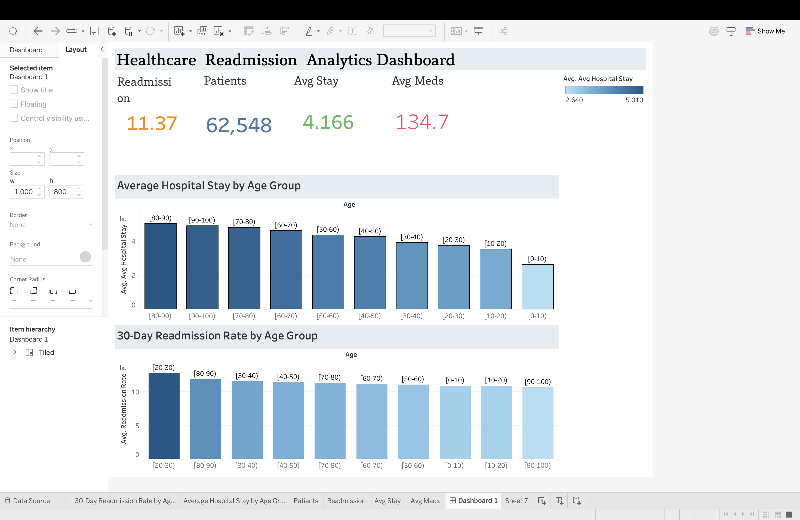

# 🏥 Healthcare Readmission Analytics Dashboard

## 📌 Project Overview
This project analyzes hospital readmission trends using healthcare patient data. The dashboard was built in Tableau after cleaning and preparing the data with Python and SQL.

## 📊 Dashboard KPIs
- Total Patients
- Readmission Rate
- Average Hospital Stay
- Average Medications

## 📈 Dashboard Visualizations
- Average Hospital Stay by Age Group
- 30-Day Readmission Rate by Age Group
- Executive KPI Cards

## 🛠 Tools Used
- SQL
- Python (Pandas)
- Tableau
- Excel
- GitHub

## 📂 Files Included
- Healthcare_Readmission_Analytics_Dashboard.twbx
- age_group_summary.csv

## 📸 Dashboard Preview

*(Upload a screenshot named `dashboard.png` later, then replace this line with:)*

```markdown

```

## 👩‍💻 Author

**Vaishnavi Kadium**

Master's in Health Data Analytics  
University of North Texas
